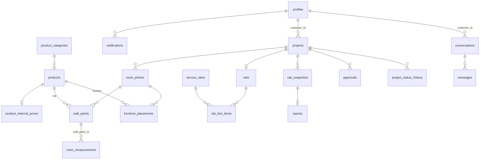

# ERD & Hak Akses

## Diagram



## Tabel

| Tabel | Isi | Entitas PRD |
|---|---|---|
| `profiles` | Data user + `role` (`customer`, `admin`, `super_admin`) | — |
| `product_categories` | Kategori katalog | Product Catalog |
| `products` | Produk + harga customer (U), warna cat, dimensi furnitur, URL gambar | Product Catalog |
| `product_internal_prices` | Harga internal (I) | Product Catalog |
| `service_rates` | Tarif jasa (`per_m2` / `flat`) | — |
| `app_settings` | Pengaturan, contoh: pajak | — |
| `projects` | Project desain + `status` + `code` (nomor pesanan) | Project |
| `room_photos` | Foto asli & hasil proses | Room Photo |
| `wall_paints` | Area dinding + cat yang dipilih | Wall Paint |
| `furniture_placements` | Posisi, skala, rotasi furnitur | Furniture Placement |
| `room_measurements` | Ukuran manual, `area` dihitung otomatis | Room Measurement |
| `rabs` | Total RAB (dihitung database) | RAB |
| `rab_line_items` | Baris RAB (otomatis & manual) | RAB |
| `rab_snapshots` | Snapshot final, tidak bisa diubah | Report (final_snapshot) |
| `reports` | PDF final, 1 per snapshot | Report |
| `project_status_transitions` | Aturan perpindahan status | — |
| `project_status_history` | Riwayat perpindahan status | — |
| `approvals` | Keputusan super admin | — |
| `notifications` | Notifikasi in-app (Realtime) | — |
| `conversations`, `messages` | Chat customer ↔ admin (Realtime) | — |
| `audit_logs` | Jejak perubahan RAB, snapshot, katalog, tarif, profil | — |

## Hak akses (ringkas)

| Data | Customer | Admin | Super Admin |
|---|---|---|---|
| Project & detailnya | Miliknya. Edit hanya saat `draft` / `ready_to_submit` | Semua. Edit saat diproses | Semua |
| Katalog (produk aktif) | Baca | Baca + kelola | Baca + kelola |
| Harga internal | ✗ | ✓ | ✓ |
| RAB & snapshot | ✗ | ✓ (edit sesuai status) | ✓ |
| Approval | ✗ | Baca | Baca + memutuskan |
| Laporan PDF | Miliknya | ✓ | ✓ |
| Chat | Miliknya | Semua | Semua |
| Audit log | ✗ | Baca | Baca |
| Ubah role user | ✗ | ✗ | ✓ (`set_user_role`) |

## Fungsi yang dipanggil dari web/android (RPC)

| Fungsi | Dipanggil oleh | Kegunaan |
|---|---|---|
| `change_project_status(p_project_id, p_to_status, p_note)` | Semua role | Satu-satunya cara mengubah status project |
| `calculate_rab(p_project_id)` | Admin, super admin | Hitung / hitung ulang RAB otomatis (baris manual dipertahankan) |
| `set_user_role(p_user_id, p_role)` | Super admin | Ubah role user |
| `my_role()`, `is_staff()`, `is_super_admin()` | Semua | Cek role user yang sedang login |
| `can_read_project(id)`, `can_edit_rab(id)` | Semua | Cek hak akses (untuk menampilkan/menyembunyikan tombol di UI) |

Contoh dari web (TypeScript):

```ts
await supabase.rpc('change_project_status', {
  p_project_id: projectId,
  p_to_status: 'pending_approval',
  p_note: null,
})
```
